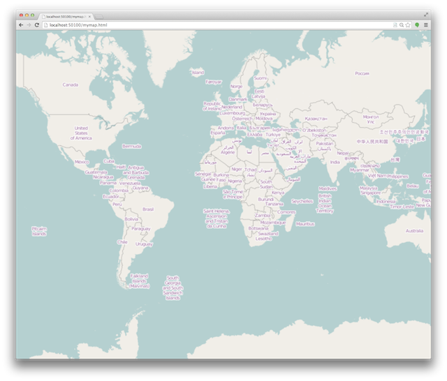

.. _project-setup-guide:

=================
Quick start guide
=================

Build dependencies
------------------

The following software is required to build geojs from source:

* `Git <http://git-scm.com/>`_
* `Node.js <http://nodejs.org/>`_

In addition, the following python modules are recommended for development
and testing of geojs.

* `Python 2.7 <http://www.python.org/>`_
* `Make <http://www.gnu.org/software/make/>`_
* `CMake <http://www.cmake.org/>`_
* `Pillow <http://pillow.readthedocs.org/en/latest/>`_
* `Requests <http://docs.python-requests.org/en/latest/>`_
* `Selenium <http://docs.seleniumhq.org/>`_

Getting the source code
-----------------------

Get the latest geojs source code from our `GitHub repository`_
by issue this command in your terminal. ::

    git clone https://github.com/OpenGeoscience/geojs.git

This will put all of the source code in a new directory called
``geojs``.  The GeoJS library is packaged together with another
library `vgl`_.  Formally, this library was included as a git
submodule.  Currently, vgl is downloaded from npm to integrate
better with workflows used by web projects.

.. _GitHub repository: https://github.com/OpenGeoscience/geojs
.. _vgl: https://github.com/OpenGeoscience/vgl

Building the source
-------------------

Inside the new ``geojs`` directory, you can simply run the following commands to
install all dependent javascript libraries and bundle together everything that
is needed. ::

    npm install
    npm run build

Compiled javascript libraries will be named ``geo.min.js`` and ``geo.ext.min.js`` in ``dist/built``.
The first file contains geojs and vgl bundled together with a number of dependent libraries.
The second file contains d3.  The bundled libraries are minified, but source maps are provided

.. _quick-start-guide:

Using the library
-----------------

The following html gives an example of including all of the necessary files
and creating a basic full map using the `osmLayer` class.

.. code-block:: html

    <head>
        
        

        

        
    </head>
    <body>
        

    </body>

You can save this page into a new file at ``dist/mymap.html``.  To view your new creation,
start up a web server with the command ::

    npm run examples

Now, if you open up `<http://localhost:8082/mymap.html>`_ in your favorite webgl enabled
browser, you should see a map like the following:

Additionally, you will be able to see all of the built-in examples at
`<http://localhost:8082/examples>`_ with the example server running.
